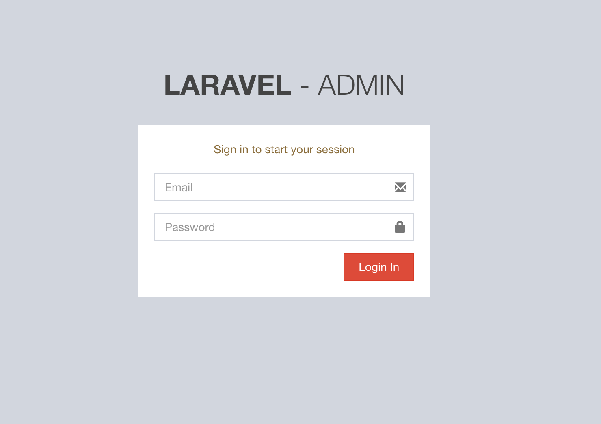
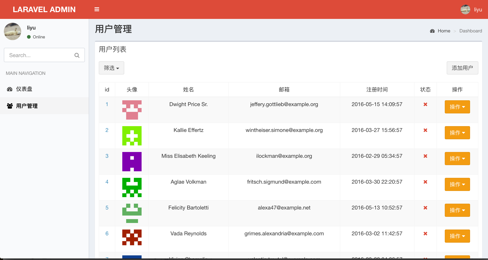

# laravel-admin-demo

工作中使用 adminLTE 写的后台，挺好用的，整理一下，写个demo

## 介绍

- 使用bower管理前端的库(adminLTE, jQuery, Bootstrap, requirejs...)
- 项目的css，js，front等资源文件放在asset中对应的目录中，部署的时候使用gulp移动到public中
- 最后所有第三方的css合并成一个all.css，项目的sass编译为app.css
- 使用requirejs异步加载所有的js

个人觉得这样应该是laravel比较好的打开方式，不知道怎么处理好的时候，多看看别人的项目还是很有帮助的，比如viease，phphub-server等

## DEMO

http://laravel-admin.lyyw.info/

email: admin@foo.com

password: 123456

## usage

### normal
- install composer, npm, bower, gulp
- composer install
- npm install
- bower install
- cp .env.example .env
- php artisan key:generate
- configure your .env
- php artisan migrate
- php artisan db:seed
- gulp

### envoy
- install envoy
- envoy run init
- configure your .env
- envoy run database

## TODO
- search tips
- users posts curd
- breadcrumbs

